<p align="center">
  
</p>

<p align="center">
  
  
  
  
</p>

# Podiom

A thin orchestration layer for local LLM agents (Claude Code, OpenAI Codex atm.).
Podiom shells out to the native `claude` and `codex` CLIs and leans on *their*
MCP, tools, and skills, while owning its own durable truth: named agents, durable
chat sessions, a canonical history that replays onto a fresh backing CLI session
on any profile/provider switch, an embedded scheduler, and a shared project
ledger. It ships as a single Go binary with an embedded Svelte web UI.

## Quick start (dev)

### Install

macOS/Linux:

```sh
curl -fsSL https://github.com/Podiom/Podiom/releases/latest/download/install.sh | bash
```

Windows PowerShell:

```powershell
irm https://podiom.ai/install.ps1 | iex
```

The installer downloads the matching release binary, verifies checksums, can set
up user-level autostart, and launches `podiom onboard` to check Claude/Codex and
create your first agent.

Every commit to `master` publishes a GitHub Release using the automatic
`v0.1.<run-number>` series. That series is intentionally monotonic rather than
calendar-based, so bursts of work can produce many releases without implying a
monthly cadence.

After install, updates can be checked and applied from the CLI or web UI:

```sh
podiom update check
podiom update apply --yes
```

Linux releases are distro-neutral static binaries.

### Development

Prerequisites: Go 1.26+, Node 20+ (for building the web UI).

```sh
# Build the web UI (vite) and both binaries into bin/ with a version stamp.
make build

# Run the daemon (foreground). It scaffolds ~/.podiom on first run.
./bin/podiomd

# In another shell, check it's live.
./bin/podiom status
```

Open http://127.0.0.1:8787 for the web UI.

To develop the frontend with hot reload, run `npm run dev` in `web/` (it proxies
API/WebSocket traffic to a running `podiomd`).

### Cross-platform builds & packaging

`podiomd` is a single static binary with the SPA embedded — no external assets,
no cgo (pure-Go SQLite via `modernc.org/sqlite`), so it cross-compiles cleanly:

```sh
make cross    # linux/darwin/windows × amd64/arm64 → bin/<os>-<arch>/
make package  # archives release artifacts into dist/ and writes SHA256SUMS
```

All runtime state lives under one overridable root, so running Podiom as a Home
Assistant add-on or in a container is a packaging step, not a rewrite:

```sh
PODIOM_HOME=/data/podiom ./bin/podiomd   # relative values are anchored absolute
```

The web bind is configurable in `config.yaml` (`server.bind` / `server.port`,
default `127.0.0.1:8787`); see [Configuration](docs/configuration.md).

## Layout

```
cmd/podiom/     thin CLI client
cmd/podiomd/    daemon: web server + scheduler + core
internal/       core, adapter, exec, schedule, config, store, server, client
web/            Svelte + Vite + TS + Tailwind SPA (built → embedded)
docs/           requirements, CLI reference, configuration, integration contracts
```

All runtime state lives under `$PODIOM_HOME` (default `~/.podiom/`).

## Documentation

- [Requirements](docs/requirements.md) — the authoritative spec (v1.6).
- [CLI reference](docs/cli.md)
- [Configuration](docs/configuration.md)
- [Scheduling](docs/scheduling.md)
- [Projects & Roadmap](docs/projects.md)
- [Goals](docs/goals.md) — hand an outcome to an agent; it plans, reviews, and reports back
- [Workspace tools](docs/workspace-tools.md) — approved per-agent CLI installs
- [Voice input](docs/voice-input.md) — speak prompts in chat, tasks, and goals (OpenAI Whisper)
- [Security & logging](docs/security.md) — permission modes, gateway token, redaction, run logs
- [Home Assistant app](docs/home-assistant.md) — deploy Podiom as an HA add-on
- [Integration contracts](docs/integrations/README.md)
